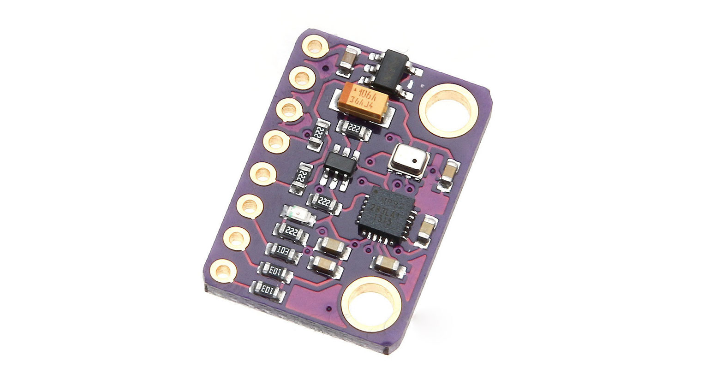
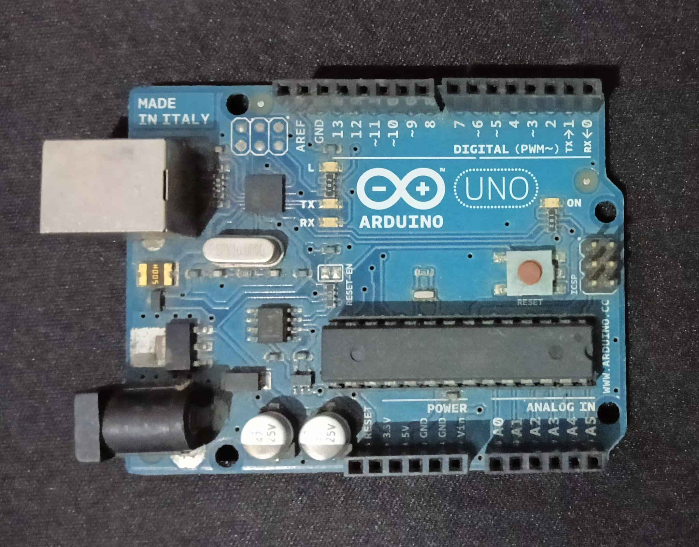
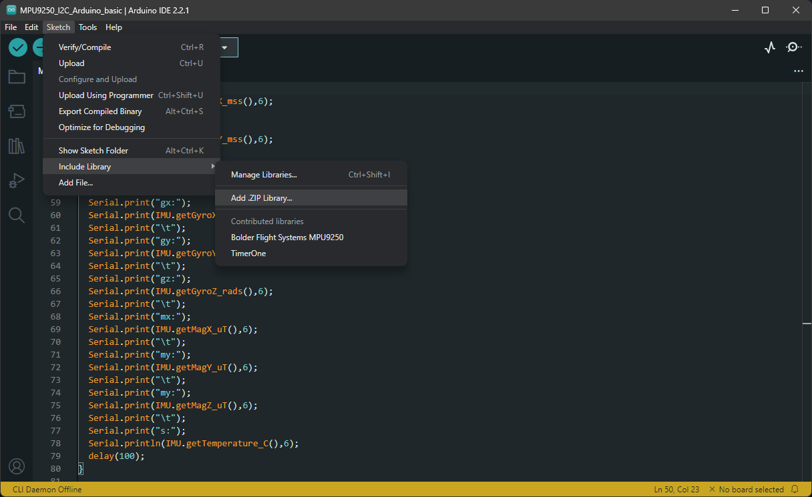
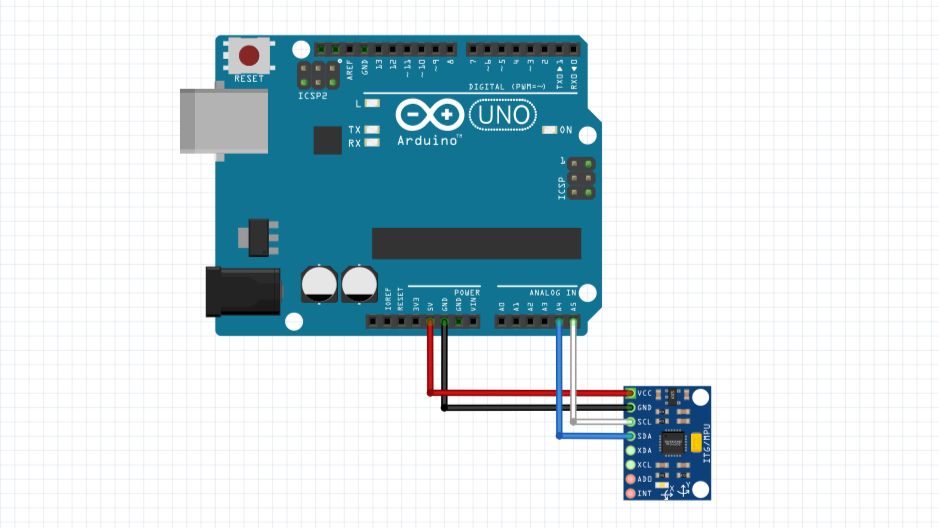
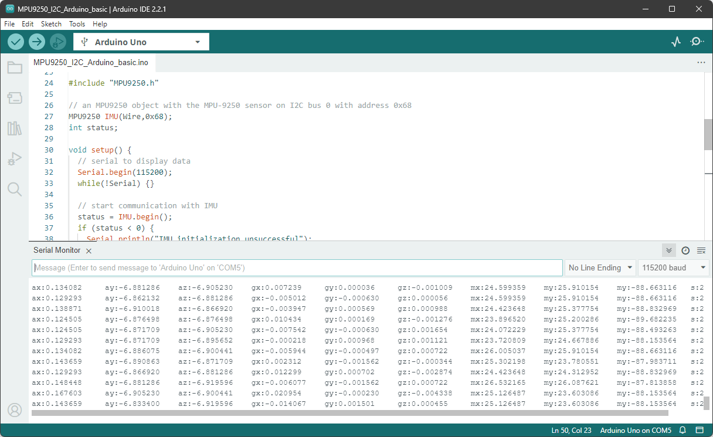

# Building a 3D Motion Tracker: Integrating IMU, Arduino, Babylon.js, and GridDB


## Introduction

In this tutorial, we will build a 3D motion tracker that can visualize the motion of an object in real-time. The motion data is collected from an IMU sensor and Arduino Uno, processed in Node.js, and visualized in Babylon.js. The GridDB is used for data store for future analysis.

## Project Source Code

This project requires  [hardware](#hardware-requirements) and [software](#software-requirements) components. The source code for this project can be found in the following GitHub [repository](https://github.com/junwatu/3d-motion-tracking).

To run the server, you need to install the dependencies first by running the following command:

```shell
cd app/server
npm install
```

Then run the server using the following command:

```shell 
npm start
```

The source code for Arduino can be found in the `app/hardware` directory. Please read the [setup the development environment](#setting-up-the-development-environment) section to import the necessary libraries.

## System Architecture

The following diagram shows the system architecture of this project:

[//]: # (put system architecture diagram here)

## Hardware Requirements

### IMU sensor

An IMU sensor, or Inertial Measurement Unit sensor is a device that measures the motion, orientation, and environmental conditions of an object. It consists of an **accelerometer**, **gyroscope**, and **magnetometer**. The accelerometer measures the acceleration of the object, the gyroscope measures the angular velocity, and the magnetometer measures the magnetic field. The IMU sensor used in this project is the [MPU-9250](https://invensense.tdk.com/download-pdf/mpu-9250-datasheet/). We will use GY-91 module that contains the MPU-9250 sensor.

[//]: # (put GY-91 device screenshot here)


### Arduino board

In this project, we use [Arduino Uno](https://docs.arduino.cc/hardware/uno-rev3/) to read the sensor data from the IMU sensor. The Arduino Uno is a microcontroller board based on the ATmega328P. It has 14 digital input/output pins, 6 analog inputs, a 16 MHz quartz crystal, a USB connection, a power jack, an ICSP header, and a reset button.

[//]: # (put Arduino Uno board screenshot here)


## Software Requirements

These are the main software components used in this project:

### Arduino IDE

The Arduino Uno is programmed using the [Arduino Software (IDE)](https://docs.arduino.cc/software/ide-v2/tutorials/getting-started-ide-v2/). Please follow the [official guide](https://docs.arduino.cc/software/ide-v2/tutorials/getting-started/ide-v2-downloading-and-installing/) to install the Arduino IDE on your computer.

### Node.js

Node.js is an open-source, cross-platform, JavaScript runtime environment that executes JavaScript code outside a web browser. It is used to build scalable network applications. Please follow the [official guide](https://nodejs.org/en/download/) to install Node.js on your computer.

Node.js is used as a server to process the motion data from the IMU sensor, store to database and send it to the web browser.

### GridDB

GridDB is an open-source, in-memory NoSQL database for IoT and big data applications. It is optimized for time-series data and geospatial data. Please follow the [official guide](https://griddb.org/docs/install-and-setup/) to install GridDB on your computer.

GridDB is used to store the motion data from the IMU sensor for future analysis.

## Initial Setup Instructions

### Setting up the hardware

These are the Bill of Materials (BOM) for this project:

| Item                         | Quantity | Description                                  |
|------------------------------|----------|----------------------------------------------|
| Arduino Uno Board            | 1        | Microcontroller platform for the project.    |
| GY-91 IMU Sensor Module      | 1        | Provides inertial measurement data.          |
| USB Cable                    | 1        | Connects Arduino to a computer for power and programming. |
| Jumper Wires                 | 4        | 2 for power, 2 for I2C communication.        |
| Breadboard                   | 1        | Platform for prototyping and testing circuits. |

> Depending on your IMU sensor module, you may need to solder header pins to the module. You'll need a soldering iron and lead or lead-free solder for this task.

There is no need to provide stand-alone power supply because the IMU sensor module and Arduino Uno will be powered by the USB cable from the computer. The interconnection between the IMU sensor module and Arduino Uno will be done using the jumper wires.

### Setting up the development environment

[//]: # (Clearly brief explanation of the development environment setup)
Open the Arduino IDE and import the `MPU9250.zip` library package into the IDE. The package can be downloaded from [here](https://github.com/junwatu/3d-motion-tracking/raw/main/app/hardware/MPU9250.zip).

To import the library, go to `Sketch > Include Library > Add .ZIP Library...` and select the `MPU9250.zip` file.



## IMU and Arduino Integration

### Connecting the IMU sensor with Arduino

The IMU sensor is connected to the Arduino Uno using the I2C interface. The device interconnection is shown in the following diagram:

[//]: # (put device interconnection diagram here)


The connections are as follows:

| Arduino Uno Pin | GY-91 IMU Sensor Pin |
|-----------------|-------------------|
| 3.3V            | VCC               |
| GND             | GND               |
| A4 (SDA)        | SDA               |
| A5 (SCL)        | SCL               |

Please remember to program the Arduino Uno. It needs to be connected to the computer using the USB cable.

### Reading sensor data using Arduino

To read sensor data using from Arduino, we need to porgram the Arduino first. Create a new sketch then copy and paste the following code into the sketch:

```c++
#include "MPU9250.h"

// an MPU9250 object with the MPU-9250 sensor on I2C bus 0 with address 0x68
MPU9250 IMU(Wire,0x68);
int status;

void setup() {
  // serial to display data
  Serial.begin(115200);
  while(!Serial) {}

  // start communication with IMU 
  status = IMU.begin();
  if (status < 0) {
    Serial.println("IMU initialization unsuccessful");
    Serial.println("Check IMU wiring or try cycling power");
    Serial.print("Status: ");
    Serial.println(status);
    while(1) {}
  }
}

void loop() {
  // read the sensor
  IMU.readSensor();
  // display the data
  Serial.print("ax:");
  Serial.print(IMU.getAccelX_mss(),6);
  Serial.print("\t");
  Serial.print("ay:");
  Serial.print(IMU.getAccelY_mss(),6);
  Serial.print("\t");
  Serial.print("az:");
  Serial.print(IMU.getAccelZ_mss(),6);
  Serial.print("\t");
  Serial.print("gx:");
  Serial.print(IMU.getGyroX_rads(),6);
  Serial.print("\t");
  Serial.print("gy:");
  Serial.print(IMU.getGyroY_rads(),6);
  Serial.print("\t");
  Serial.print("gz:");
  Serial.print(IMU.getGyroZ_rads(),6);
  Serial.print("\t");
  Serial.print("mx:");
  Serial.print(IMU.getMagX_uT(),6);
  Serial.print("\t");
  Serial.print("my:");
  Serial.print(IMU.getMagY_uT(),6);
  Serial.print("\t");
  Serial.print("my:");
  Serial.print(IMU.getMagZ_uT(),6);
  Serial.print("\t");
  Serial.print("s:");
  Serial.println(IMU.getTemperature_C(),6);
  delay(100);
}
```

The code tells us to read the sensor data via the I2C bus (`Wire`) at address `0x68` for every 100 milliseconds. The data is sent to the serial port at a baud rate of `115200`and it is in the form of a comma-separated string. The first 9 values are the **accelerometer**, **gyroscope**, and **magnetometer** data. The last value is the **temperature** in Celsius.

Upload the sketch to the Arduino Uno by clicking the **Upload** button on the top left corner of the Arduino IDE.

[//]: # (put upload process gif here)

Open the serial monitor to see the sensor data. The serial monitor can be opened by clicking the magnifying glass icon on the top right corner of the Arduino IDE.

[//]: # (put serial monitor screenshot here)


In the serial monitor you should see the sensor data in the following format:

```shell
ax:0 ay:0 az:-9.1 gx:0 gy:0 gz:0 mx:13.0 my:57.1 my:-105.3 s:27.4
```

This data will be parsed by Node.js later.

## Node.js and WebSocket Integration

### Read sensor data from Arduino

Node.js reads the sensor data from the Arduino Uno via the serial port. In this project we use the [serialport](https://serialport.io/) library to read the data.

```js
import { SerialPort } from 'serialport';
import { ReadlineParser } from '@serialport/parser-readline';
import { saveData, getAllData, getDatabyID, info } from './griddbservices.js';

// Serial port setup
const port = new SerialPort({ path: 'COM5', baudRate: 115200 });
const parser = port.pipe(new ReadlineParser({ delimiter: '\n' }));

parser.on('data', (data) => {
 console.log(data);
 const parsedData = parseSensorData(data);
 await saveData({ sensorData: JSON.stringify(parsedData) });
 broadcastData(JSON.stringify(parsedData));
});
```

The data then `broadcasted` to the web browser via WebSocket and also stored in GridDB for future analysis.

```js
await saveData({ sensorData: JSON.stringify(parsedData) });
```

### Websocket

WebSocket is a communication protocol that provides full-duplex communication channels over a single TCP connection. It is used in this project to send the sensor data from Node.js to the web browser in real-time. We use the [ws](https://www.npmjs.com/package/ws) library to implement the WebSocket server in Node.js.

```js
import express from 'express';
import { createServer } from 'http';
import { WebSocketServer, WebSocket } from 'ws';

const app = express();
const server = createServer(app);
const wss = new WebSocketServer({ server });

wss.on('connection', (ws) => {
  console.log('WebSocket client connected');
  ws.on('close', () => console.log('WebSocket client disconnected'));
});

const broadcastData = (data) => {
 wss.clients.forEach((client) => {
  if (client.readyState === WebSocket.OPEN) {
   client.send(data);
  }
 });
};
```

## Processing and Visualizing Data

### Data Processing

The data is parsed and then processed for adjusting the coordinate system and converting the units. Make sure to read the sensor data sheet before to understand the units of the sensor data.

```js
function parseSensorData(data) {
 // Parse the data string
 const sensorValues = data.split('\t').map(val => parseFloat(val.split(':')[1]));

 // The order of the data is ax, ay, az, gx, gy, gz, mx, my, mz
 const [ax, ay, az, gx, gy, gz, mx, my, mz, s] = sensorValues;

 // Normalize accelerometer data if needed (currently in m/s², convert to g's if necessary)
 const accel = {
  x: ax / 1000,
  y: ay / 1000,
  z: az / 1000
 };

 // Gyroscope data is in rad/s, which is what the Madgwick filter expects, so no conversion needed
 const gyro = { x: gx, y: gy, z: gz };

 // Magnetometer data is in microteslas (uT), convert to Teslas by dividing by 1,000,000 if necessary
 const mag = {
  x: mx / 1000000,
  y: my / 1000000,
  z: mz / 1000000
 };

 const temp = { s }

 return { accel, gyro, mag, s };
}
```
This parsed data is then sent to the web browser via WebSocket.

### Visualizing with Babylon.js

To visualize the motion data, we use [Babylon.js](https://www.babylonjs.com/), a JavaScript framework for building 3D games and applications with WebGL and WebVR. The HTML is as follows:

```html
<!DOCTYPE html>
<html>
<head>
	<meta charset="utf-8" />
	<title>3D Sensor Visualization</title>
	<script src="https://cdn.babylonjs.com/babylon.js"></script>
	<style>
		#renderCanvas {
			width: 100%;
			height: 100vh;
			touch-action: none;
		}
	</style>
</head>

<body>
	<canvas id="renderCanvas"></canvas>
	<script>
		window.addEventListener('DOMContentLoaded', () => {
			const canvas = document.getElementById('renderCanvas');
			const engine = new BABYLON.Engine(canvas, true);

			const createScene = () => {
				const scene = new BABYLON.Scene(engine);
				const camera = new BABYLON.ArcRotateCamera("camera", -Math.PI / 2, Math.PI / 2.5, 10, new BABYLON.Vector3(0, 0, 0), scene);
				camera.attachControl(canvas, true);
				new BABYLON.HemisphericLight("light", new BABYLON.Vector3(1, 1, 0), scene);
				const box = BABYLON.MeshBuilder.CreateBox("box", { size: 2 }, scene);
				return { scene, box };
			};

			const { scene, box } = createScene();

			const ws = new WebSocket('ws://localhost:3000');
			ws.onmessage = (event) => {
				const sensorData = JSON.parse(event.data);
				const { gyro } = sensorData;

				// Update cube rotation with gyro data in radians/s
				// Assume you're receiving data at a rate of 60Hz (or adjust as per your rate)
				box.rotation.x += gyro.x / 10; // Update rotation based on gyro data
				box.rotation.y += gyro.y / 10;
				box.rotation.z += gyro.z / 10;
			};

			engine.runRenderLoop(() => {
				scene.render();
			});

			window.addEventListener('resize', () => {
				engine.resize();
			});
		});
	</script>
</body>

</html>
```

The code above creates a scene with a camera, light, and a box. The box will be rotated based on the gyroscope data from the IMU sensor. The gyroscope data is received via WebSocket from Node.js.

[//]: # (demo here)

By default the WebSocket URL run on `localhost` with the port `3000`. You need to change the WebSocket URL to match your Node.js server URL and change the code in this line:

```js
const ws = new WebSocket('ws://localhost:3000');
```

## Storing Data with GridDB

The GridDB is used to store the motion data from the IMU sensor for future analysis. The file `app/server/griddbservices.js` is a wrapper for `libs/griddb.js` that contains the GridDB functions. 

To save parsed sensor data to GridDB, the code is as follows:

```js
await saveData({ sensorData: JSON.stringify(parsedData) });
```

The data is stored in the form of a JSON string. You can look at the `libs/griddb.js` file to see how the data is stored in GridDB.

```js
function initContainer() {
	const conInfo = new griddb.ContainerInfo({
		name: containerName,
		columnInfoList: [
			['id', griddb.Type.INTEGER],
			['data', griddb.Type.STRING],
		],
		type: griddb.ContainerType.COLLECTION,
		rowKey: true,
	});

	return conInfo;
}
```

## Data Retrieval from GridDB

To retrieve all data from GridDB, the code is as follows:

```js
app.get('/', async (req, res) => {
	log.info('Getting all data from GridDB');
	try {
		const result = await getAllData();
		res.json(result);
	} catch (error) {
		res.status(500).send('Error getting all data');
	}
})
```
You can retrieve the data from the browser by accessing the URL `http://localhost:3000/`.

[//]: # (retrieve all data screenshot)